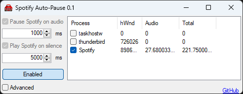

# spotify-auto-pause

Automatically toggles playback status of Spotify. Pauses Spotify playback when another application plays audio. Resumes Spotify playback when audio is stopped.

- Press minimize to show a tray icon.
- Press close to exit the application.
- Click tray icon to show main window.

Enabled by default, spotify-auto-pause lists all applications that have played audio.
This list shows a "Process" column, an "hWnd" column for the main window handle of the process, an "Audio" column for the current audio peak level from the process, and a "Total" column to needlessly sum the audio peak levels over the session.
For processes that are checked, spotify-auto-pause will send an [appcommand](https://learn.microsoft.com/en-us/windows/win32/inputdev/wm-appcommand?redirectedfrom=MSDN) to the checked processes main window to play or pause playback.
